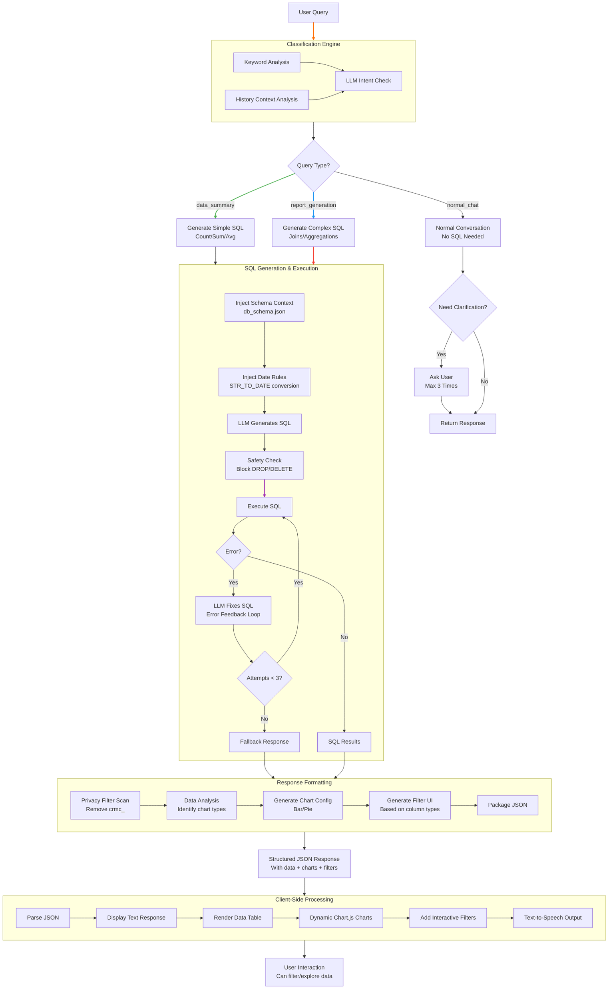

# Data Analytics Orchestrator - Technical Architecture & Flow

This document provides a comprehensive technical breakdown of the Data Analytics Orchestrator, detailing the architecture, intelligence implementation, data flow, and security mechanisms.

## 1. System Architecture

The solution operates as a **Hybrid Agentic System** combining a browser-based frontend for state management and a Python backend for intelligent query processing.

### Components
*   **Frontend**: Chrome Extension (`sidepanel.html`, `sidepanel.js`)
    *   **Role**: State Orchestrator, UI Rendering, Voice Processing.
    *   **State Management**: `localStorage` (Session, History, Reports).
    *   **Voice**: Web Speech API + Google US English Female TTS.
*   **Backend**: FastAPI Server (`intelligent_bot.py`)
    *   **Role**: Intelligence Layer, SQL Generator, Database Interface.
    *   **AI Engine**: OpenAI Client (Novita AI endpoint).
    *   **Database**: MySQL (PyMySQL driver).

---

## 2. The Intelligence Layer (Backend Deep Dive)

The core "brain" of the system relies on sophisticated prompt engineering and self-healing mechanisms, not just simple API calls.

### A. Contextual Prompt Engineering
The system uses a highly structured System Prompt (`_build_comprehensive_system_prompt`) that enforces strict behavioral rules:

1.  **Legacy Date Handling**:
    *   **Problem**: Database dates are stored as `VARCHAR` in `DD/MM/YY` format.
    *   **Solution**: The prompt explicitly forbids `LIKE` operators on dates.
    *   **Enforcement**: Mandatory `STR_TO_DATE(column, '%d/%m/%y')` conversion rule injected into every prompt.
2.  **Schema Hallucination Prevention**:
    *   Rules explicitly list the *exact* column names to be used.
    *   "NEVER HALLUCINATE" warnings are repeated for critical tables like `crmc_po_info_lumy`.
3.  **Master Data Resolution**:
    *   Mandatory rule to always `JOIN` ID columns with Name columns (e.g., `vendor_id` + `Vendor_Name`) to ensure user-readable output.

### B. Self-Healing Retry Loop (`execute_sql_with_retry`)
The system attempts to self-correct SQL errors before failing:

1.  **Attempt 1**: Generate SQL based on user query + Schema.
2.  **Execution Check**: Run SQL via `execute_sql_query`.
3.  **Error Feedback Loop**:
    *   If Execution Fails (e.g., "Unknown column"), the *exact error message* is fed back to the LLM.
    *   **Correction Prompt**: "CRITICAL: Previous SQL attempt failed with error: [Error]. You MUST fix the SQL query by..."
    *   The system retries up to **3 times**, progressively enforcing stricter schema adherence.

### C. Privacy & Security Layer (`_filter_response_for_privacy`)
A regex-based post-processing step ensures internal architecture is never exposed:
*   **Blocked Terms**: `crmc_`, `table structure`, `schema`, `column names`.
*   **Response**: If a blocked term is detected, the response is replaced with a canned "I am your Business Analyst" safe message.
*   **Sanitization**: All internal emojis and debug markers are stripped before reaching the client.

## 3. Data Flow Specification

### Step 1: User Intent (Frontend)
The user enters a query ("Show me vendor spend").
*   **Pre-check**: `checkPredefinedQueries` scans `final_queries.json` for instant matches (0ms latency).
*   **Client Fallback**: If API is unreachable, `generateContextualResponse` provides realistic "simulated" data for key topics (Vendors, Departments) to keep the demo flow alive.

### Step 2: Request Processing (Backend)
`/chat` endpoint receives `{ message, history }`.
1.  **Context Extraction**: Analyzes last 10 messages to resolve references (e.g., "Show me *its* details" -> resolves "its" to previous item).
2.  **Classification**: Determines if request is `normal_chat`, `data_summary`, or `report_generation`.

### Step 3: SQL Generation & Execution
1.  **SQL Generation**: LLM constructs query using the `db_schema.json` context.
2.  **Validation**: `_fix_date_format_in_sql` runs a regex pass to auto-correct common date mistakes (e.g., `LIKE '2025%'` -> `YEAR() = 2025`) before execution.
3.  **Safety Check**: Blocks `DROP`, `DELETE`, `UPDATE` keywords.

### Step 4: Response Formatting
The backend returns a structured JSON object, not just text:
```json
{
  "message": "Here is the vendor spend report...",
  "results": {
    "type": "enhanced_llm",
    "sql_data": { "data": [...] },
    "charts": [ { "type": "bar", "labels": [...], "data": [...] } ],
    "filters": [ { "column": "Vendor_Name", "values": [...] } ]
  }
}
```

### Step 5: Rendering (Frontend)
`sidepanel.js` > `handleAPIResponse`:
1.  **Text**: Added to chat history.
2.  **Voice**: TTS Engine reads the summary.
3.  **Visuals**:
    *   `renderMessage` detects `sql_data` and builds a dynamic HTML Table.
    *   Chart.js is initialized if `charts` array is present.
    *   Interactive Filters are rendered if `filters` are present.

## 4. Key Files Reference

*   **`intelligent_bot.py`**:
    *   `_build_comprehensive_system_prompt`: deeply engineered prompt instructions.
    *   `execute_sql_with_retry`: The self-healing logic.
*   **`sidepanel.js`**:
    *   `callAPI`: Networking layer.
    *   `renderMessage`: Complex UI Builder.
*   **`sidepanel.html`**:
    *   Base structure for 5-tab layout (Chat, Queries, Dashboard, Reports, Insights).

## 5. Detailed Query Lifecycle (Abhi Flow)

This section details exactly how the system takes a query, classifies it, decides to generate SQL, and provides a response.

### Step 1: Taking the Query
*   **Input**: The user types a message or uses voice input in `sidepanel.html`.
*   **Frontend Action**: `sendMessage()` in `sidepanel.js` captures this input.
*   **Networking**: It sends a POST request to `http://localhost:8000/chat` with:
    *   `message`: The current user text.
    *   `history`: The last 10 messages for context.

### Step 2: Classifying the Query (Based on What?)
The backend (`intelligent_bot.py`) uses **Keyword Processing** (not just LLM) to instantly classify the intent via `classify_request_type`:

1.  **Check 1 - Vague Requests** (e.g., "Show me data", "I need insights"):
    *   **Logic**: If it has vague keywords BUT lacks specific details (like "last 3 months" or "Cardiology"), it forces `normal_chat` to ask for clarification.
2.  **Check 2 - Data Summary** (e.g., "How many vendors?", "Total spend"):
    *   **Logic**: Checks for summary keywords: `count`, `total`, `sum`, `average`.
    *   **Result**: Classifies as `data_summary`.
3.  **Check 3 - Report Generation** (e.g., "Top 10 vendors", "Spending breakdown"):
    *   **Logic**: Checks for analytical keywords: `top 10`, `breakdown`, `compare`, `trend`.
    *   **Result**: Classifies as `report_generation`.

### Step 3: Deciding to Generate Query (The Decision)
Once classified, the system must decide **"Should I write SQL or just talk?"**. This happens in `chat_endpoint` and `is_sql_ready`:

1.  **Conversation Management**: The LLM first receives the user message with a "Conversation System Prompt".
2.  **The Decision Logic**: The system checks the LLM's initial text response for **Specific Trigger Phrases**:
    *   **Positive Triggers**: "Perfect! I'll generate that report", "Generating your report now".
    *   **Negative Triggers**: "What specific...", "Could you clarify...".
3.  **Result**:
    *   If **Positive Trigger** found -> **PROCEED TO SQL**.
    *   If **Negative Trigger** found -> **STOP & ASK USER**.

### Step 4: Generating the Query (Based on What?)
If the decision is "PROCEED", the system calls `process_enhanced_query_with_classification`. The SQL is generated based on **Strict Context Injection**:

1.  **Schema Context**: The *entire* database schema (tables, columns) is injected into the prompt.
2.  **Date Rules**: The specific rule `use STR_TO_DATE(col, '%d/%m/%y')` is injected.
3.  **User Context**: Any extracted filters (Time Period="Last 3 months", Dept="Surgery") are explicitly added to the instructions.
4.  **LLM Action**: The LLM writes a `SELECT` statement trying to adhere to these constraint rules.

### Step 5: Executing the Query (The Self-Hearing Loop)
The system doesn't just run the query once. It uses a **3-Attempt Loop** (`execute_sql_with_retry`):

1.  **Execute**: Run the generated SQL on MySQL.
2.  **Success?**: Return data.
3.  **Failure?**:
    *   Capture the **exact error message** (e.g., "Unknown column 'total_amt'").
    *   **Feed it back to LLM**: "Critical Error! You used a wrong column. Fix it using schema."
    *   **Retry**: The LLM generates a *new* corrected query.
    *   Repeat up to 3 times.

### Step 6: Response Generation
Based on the execution result, the response is formatted:

1.  **Privacy Filter**: The raw text is regex-scanned to remove any "crmc_" table names or internal IDs.
2.  **Data Structuring**: The SQL rows are packed into `sql_data`.
3.  **Visualization Decision**:
    *   If data > 1 row AND has numbers -> Generate **Bar Chart** config.
    *   If data is categorical -> Generate **Pie Chart** config.
4.  **Client Response**: The final JSON is sent to `sidepanel.js` which renders the table, draws the charts using Chart.js, and speaks the summary using Text-to-Speech.

### Visual Flow Reference


